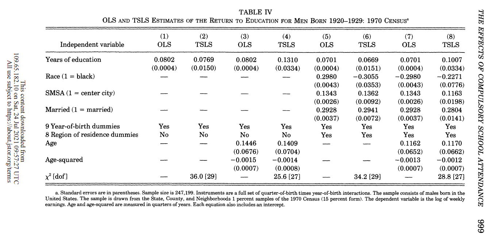

```{r, setup, include=FALSE}
knitr::opts_chunk$set(message=FALSE, warning = FALSE)
```

# Introduction

In this paper I will look at Angrist & Krueger (1991), _Does Compulsory School Attendance Affect Schooling and Earnings?_, and try to assess their results using ML tools. 

The article investigates the economic returns to education, by estimating the effect of years of education on future earnings. Because of an omitted variable bias (e.g., natural talent), the authors look for an identification strategy to reveal the causal mechanism. They utilize the policy of compulsory school attendance laws that obliged children in the U.S. to stay in school until they become 16. Their claim is that "individuals born in the beginning of the year start school at an older age, and can therefore drop out after completing less schooling than individuals born near the end of the year". So, they use the _quarters of birth_ as instrument variables, which are clearly not correlated with natural talent etc., do not directly affect future earnings, but do affect the years of schooling thanks to the policy tool described.

I will first replicate one of the main results of the article, which can be found in Table IV in page 999. The table demonstrate a positive, significant and robust return to schooling, ranging 0.067-0.13 logs of weekly wage, depend on specification.

In the second stage I will implement a double lasso to the IV specification for instrumental variable selection, out of the 36 IVs used. I would like to see if the result remain stable after using double-lasso, and whether we could benefit from the simplification of the model that this approach provide.

Finally, I will build a prediction model for the outcome variable, using machine learning models.

The data is provided by `{experimentdataR}` package.

The packages and user-defined functions I'll use:
```{r , message = FALSE}
if (!require("pacman")) install.packages("pacman")
  pacman::p_load(
    tidyverse,
    magrittr,
    fastDummies,
    stargazer,
    kableExtra,
    flextable,
    officer,
    stringr,
    EcotoneFinder,
    hdm,
    AER,
    tidymodels,
    stacks,
    glmnet,
    xgboost,
    vip
    )
  
  pacman::p_load_gh("itamarcaspi/experimentdatar")
  
# Function for table formatting
kable_format <- function(x, digits = 1, caption = NULL, position = "center") {
  kbl(x = x, digits = digits, caption = caption) %>% 
  row_spec(row = 0,bold = TRUE) %>% 
  kable_classic_2(lightable_options = c("bordered", "hover"), full_width = F, 
                  html_font = "Cambria",position = position
                  )
} 
```

# Replication

## Data Preparation
```{r}
data("IVdataset")

# Fixing variable values
IVdataset %<>% mutate(YOB    = if_else(YOB > 1000, YOB - 1900, YOB),
                      AGEQ   = if_else(AGEQ > 1000, AGEQ - 1900, AGEQ),
                      AGEQSQ = AGEQ^2
                      )

# Creating YOB dummies
for (i in 0:9) {
  IVdataset %<>% mutate(!!paste0("YR_2", i) := if_else(YOB %% 10 == i, 1, 0))
}

# Creating quarter dummies
IVdataset %<>% dummy_cols(select_columns = "QOB")

# Creating interactions for IVs
for (i in 20:29) {
  for (j in 1:4) {
    IVdataset %<>% mutate(!!paste("QOB", j, i, sep = "_") := get(paste0("YR_", i)) * get(paste0("QOB_", j)))
  }
}
```

## Table IV

```{r, results='asis'}
# Filter data for table IV
data_iv <- IVdataset %>% filter(YOB < 30)

# Variable groups
y_d            <- "LWKLYWGE ~ EDUC"
age_ctrl       <- "AGEQ + AGEQSQ"
demo_ctrl      <- "RACE + SMSA + MARRIED"
year_dummies   <- paste(paste0("YR_2", 0:9), collapse= " + ")
region_dummies <- paste("NEWENG", "MIDATL", "ENOCENT", "WNOCENT", "SOATL", "ESOCENT", "WSOCENT", "MT", sep = " + ")

# Estimating OLS
fmla1 <- as.formula(paste(y_d, year_dummies, sep = " + "))
fmla3 <- as.formula(paste(y_d, age_ctrl, year_dummies, sep = " + "))
fmla5 <- as.formula(paste(y_d, demo_ctrl, year_dummies, region_dummies, sep = " + "))
fmla7 <- as.formula(paste(y_d, age_ctrl, demo_ctrl, year_dummies, region_dummies, sep = " + "))

lm1 <- data_iv %>% lm(formula = fmla1)
lm3 <- data_iv %>% lm(formula = fmla3)
lm5 <- data_iv %>% lm(formula = fmla5)
lm7 <- data_iv %>% lm(formula = fmla7)

# Estimating 2SLS
iv_term <- ""
for (i in 20:29) {
  for (j in 1:4) {
   temp <- paste("QOB", j, i, sep = "_")
   iv_term <- paste(iv_term, temp, sep = " + ")
  }
}

iv_term <- sub("...", "", iv_term)

fmla2 <- as.formula(paste(y_d, " + ",  year_dummies, " | ", iv_term, " + ", year_dummies))

fmla4 <- as.formula(paste(y_d, " + " , age_ctrl, " + ", year_dummies,
                          " | ", iv_term, " + ", age_ctrl, " + ", year_dummies))

fmla6 <- as.formula(paste(y_d, " + ",  demo_ctrl, " + ", year_dummies, " + ", region_dummies, 
                          " | ", paste(iv_term, demo_ctrl, year_dummies, region_dummies, sep = " + ")))

fmla8 <- as.formula(paste(y_d, " + ", paste(age_ctrl, demo_ctrl, year_dummies, region_dummies, sep = " + "),
                           " | ", paste(iv_term, age_ctrl, demo_ctrl, year_dummies, region_dummies, sep = " + ")))

lm2 <- ivreg(formula = fmla2, data = data_iv)
lm4 <- ivreg(formula = fmla4, data = data_iv)
lm6 <- ivreg(formula = fmla6, data = data_iv)
lm8 <- ivreg(formula = fmla8, data = data_iv)

# Computing chi-squared
for (i in c(2, 4 ,6 ,8)) {
  temp <- summary(get(paste0("lm", i)), diagnostics = TRUE)
  assign(paste0("weak_", i), temp) # for future use in weak instruments assessment

  temp <- temp[["diagnostics"]] %>% as_tibble()
  temp <- temp[3,3] %>% mutate(statistic = round(statistic, 1)) %>% pull()
  assign(paste0("chi2_", i), temp)
}

# Output
stargazer(lm1, lm2, lm3, lm4, lm5, lm6, lm7, lm8, type = "html", digits = 4,
          title = "Table IV: OLS AND TSLS ESTIMATES OF THE RETURN TO EDUCATION FOR MEN BORN 1920-1929: 1970 CEUNSUS",
          column.labels = c(rep(c("OLS", "TSLS"), 4)), model.names = FALSE, 
          dep.var.labels.include = FALSE, dep.var.caption = "", font.size = "small",
          keep = c("EDUC", "RACE", "SMSA", "MARRIED", "AGEQ", "AGEQSQ"),
          order = c("EDUC", "RACE", "SMSA", "MARRIED", "AGEQ", "AGEQSQ"),
          covariate.labels = c("Years of education", "Race (1 = black)", "SMSA (1 = center city)", 
                               "Married (1 = married)", "Age", "Age-squared"),
          add.lines=list(c("9 Year-of-birth dummies", rep("Yes", 8)),
                         c("8 Region of residence dummies", rep("No", 4), rep("Yes", 4)),
                         c("<p>&chi;<sup>2</sup></p>", "<p>&mdash;</p>", chi2_2, "<p>&mdash;</p>",
                           chi2_4, "<p>&mdash;</p>", chi2_6, "<p>&mdash;</p>", chi2_8)),
          align = TRUE, omit.stat = "all", omit.table.layout = "n")


```

<br>

__The original table:__
{width=100%}

# Implementing Double LASSO

## Estimations

In this part I will estimate the different specification with double lasso from the `{hdm}` package, allowing for control and instrumental variables selection by using the `rlassoIV` function. I will present and discuss the result in the next sections.

```{r, results='asis', results = 'hold'}
# Preparing data for each specification
year_vars   <- paste(paste0("YR_2", 0:9), sep= ", ")
age_vars    <- c("AGEQ", "AGEQSQ")
demo_vars   <- c("RACE", "SMSA", "MARRIED")
region_vars <- c("NEWENG", "MIDATL", "ENOCENT", "WNOCENT", "SOATL", "ESOCENT", "WSOCENT", "MT")

Y   <- data_iv %>% select(LWKLYWGE)                                    %>% pull
D   <- data_iv %>% select(EDUC)                                        %>% pull()
X_2 <- data_iv %>% select(year_vars)                                   %>% as.matrix()
X_4 <- data_iv %>% select(year_vars, age_vars)                         %>% as.matrix()
X_6 <- data_iv %>% select(year_vars, demo_vars, region_vars)           %>% as.matrix()
X_8 <- data_iv %>% select(year_vars, age_vars, demo_vars, region_vars) %>% as.matrix()
Z   <- data_iv %>% select(QOB_1_20:QOB_4_29)                           %>% as.matrix()

# LASSOIV estimation for each specification
for (i in c(2,4,6,8)) {
  lasso <- rlassoIV(y = Y, d = D, x = get(paste0("X_", i)), z = Z, data = data_iv, select.X=FALSE, select.Z=TRUE)
  
  # Detecting selected variables
  is_selected <- lasso[["selected"]] %>% as_tibble()
  selected_names <- lasso[["selected"]] %>% row.names() %>% as_tibble()
  
  selected_vars <- bind_cols(selected_names, is_selected) %>%
                   rename(name = value, selected = d1) %>% 
                   filter(selected==TRUE) %>%
                   select(name)
  
  assign(paste0("selected_Z", i), selected_vars %>% filter(str_detect(name, "QOB")) %>% setNames(c(paste0("Column ", i))))
  assign(paste0("selected_X", i), selected_vars %>% filter(!str_detect(name, "QOB")) %>% setNames(c(paste0("Column ", i))))
  assign(paste0("lasso", i), lasso)
}
rm(lasso)
```

## Treatment Effect Assessment
```{r class.source='fold-hide', results='asis'}

lasso_d <- 
  tibble(Stat = c("Estimate", "Std. Error"),
         `(2)` = c(lasso2[["coefficients"]], lasso2[["se"]]),
         `(4)` = c(lasso4[["coefficients"]], lasso4[["se"]]),
         `(6)` = c(lasso6[["coefficients"]], lasso6[["se"]]),
         `(8)` = c(lasso8[["coefficients"]], lasso8[["se"]])) %>% 
  mutate(across(2:5,round, 4)) %>% 
  flextable() %>% 
    add_header_row(top = TRUE,
                 values = c("LASSO IV Treatment Effect"), 
                 colwidths = c(5)) %>% 
    align(align = "center", part = "all") %>% 
    bold(part = "header") %>% 
    fontsize(part = "header", size = 12) %>% 
    font(fontname = "serif", part = "all") %>% 
    set_table_properties(width = 0.5, layout = "autofit") %>% 
    border_outer(part = "all", border = fp_border(width = 2)) %>% 
    border_inner_v(part = "all")

lasso_d
```

```{r class.source='fold-hide', results='asis'}
stargazer(lm2, lm4, lm6, lm8, type = "html", digits = 4,
          title = "TSLS Treatment Effects",
          model.names = FALSE, dep.var.labels.include = FALSE, dep.var.caption = "",
          keep = c("EDUC"),
          column.labels = c("(2)","(4)","(6)","(8)"),
          model.numbers = FALSE,
          covariate.labels = c("Years of education"),
          align = TRUE, omit.stat = "all", omit.table.layout = "n")
```

<br>

The above result suggest an almost identical result in specification number 2, but the rest are quite different -- we have different sizes of effects, especially in 6 & 8, and they are much more significant (albeit they were already so).

On the one hand, the double lasso returned the same qualitative conclusion , and with less variables (which we'll inspect later), which could help to overcome weak instruments problems, and simplify models and specifications. On the other hand, the magnitudes of the effect shifted drastically in some specifications, which can become more problematic in other settings. 

## Variable Selection Assessment
```{r}
# Merging selected IVs and controls
selected_Z <- cbindna(selected_Z2, selected_Z4, selected_Z6, selected_Z8) %>% flextable()
selected_X <- cbindna(selected_X2, selected_X4, selected_X6, selected_X8) %>% flextable()

# Arranging in tables
title_Z <- "Selected Instrumental Variables"
title_X <- "Selected Control Variables"

for (i in c("Z", "X")) {
  selected <- get(paste0("selected_", i))
  selected %<>% 
    add_header_row(top = TRUE,
                   values = c(get(paste0("title_", i))), 
                   colwidths = c(4)) %>% 
    align(i = 1, align = "center", part = "header") %>% 
    bold(part = "header") %>% 
    fontsize(part = "header", size = 12) %>% 
    font(fontname = "serif", part = "all") %>% 
    set_table_properties(width = 0.5, layout = "autofit") %>% 
    border_outer(part = "all", border = fp_border(width = 2)) %>% 
    border_inner_v(part = "all")
  assign(paste0("selected_", i), selected)
}
```

```{r, class.source='fold-hide'}
selected_Z
selected_X
```

We see some interesting results:

* Instrumental variables:
  * All of the specifications keep the same set of IVs, where columns 4 & 8 keep a subset of it. It is probably due to the addition of the age variables (`AGEQ` & `AGEQSQ`), but I can't provide a meaningful explanation for that.
  
* Control variables:
  * In both specifications where the YOB dummies were selected (columns 2 & 6), the algorithm selected the same set out of them (`YR_20`, `YR_21`, `YR_22`, `YR_28`, `YR_29`).
  * With respect to the previous point, when we added the age variables, the YOB dummies were no longer selected. We could guess that two groups provide similar information, and `AGEQSQ` just has it all in a single variable which imposes less penalty.
  * Columns 6 & 8 keep the same set of demographic and region variables (all of them, actually), which tell us they all provide important information.

Overall, the selection allows us to get similar results (or even better) to the full specification originally conducted in the article, but with much less variables, especially IVs.

Note: It's strange, but when I ran the lasso I specified to not select Xs (otherwise there was an error). However, the results indicate the selected Xs, but I have coefficients for all of them. Not sure what happened there.

## Weak Instruments Assessment

When looking at the original IV estimations, specifications 4 & 8 suffer from weak instrument, as you can see below where the F-test is lower than 10 under the "Diagnostic tests" section:
```{r,}
weak_4
weak_8
```

It's interesting to see whether the use of lasso for IV selection can help to overcome this issue. I'll now re-estimate both specifications, using the selected variables from the previous section, and test again for weak instruments.

```{r}
# Pulling the relevant vectors as text, for formulas
Z4 <- selected_Z4 %>% pull() %>% paste(collapse = " + ")
X4 <- selected_X4 %>% pull() %>% paste(collapse = " + ")
Z8 <- selected_Z8 %>% pull() %>% paste(collapse = " + ")
X8 <- selected_X8 %>% pull() %>% paste(collapse = " + ")


fmla4_new <- as.formula(paste(y_d, " + " , X4, " | ", Z4, " + ", X4))
fmla8_new <- as.formula(paste(y_d, " + " , X8, " | ", Z8, " + ", X8))

ivreg(formula = fmla4_new, data = data_iv) %>% summary(diagnostics = TRUE)
ivreg(formula = fmla8_new, data = data_iv) %>% summary(diagnostics = TRUE)
```

On the one hand, the specifications no longer suffer from weak instruments problem, but the treatment effect is no longer significant. Not really sure what to say about that, to be honest.

# Prediction model

## Preparation
I'll first drop the unnamed variables which the authors did not provide their meaning. I could use them anyway when doing ML, but I'd rather not to. I will also sample out 10K observation for faster computation, and split the data to training and test sets.
```{r}
data_pred <- data_iv %>% select(!starts_with("v")) %>% slice_sample(n = 10000) %>% as.data.frame()

set.seed(2021)
split <- data_pred %>% initial_split(prop = 0.7)
train <- training(split)
test <- testing(split)
```

## Data Exploration

In the section I'll look at the way our control variables are correlated with the treatment, i.e., years of education.

Let's start with the region variable:
```{r}
train_explore <- train %>% 
  mutate(region = case_when(
         MIDATL ==1 ~ "MIDATL",
         MT     ==1 ~ "MT",
         NEWENG ==1 ~ "NEWENG",
         SOATL  ==1 ~ "SOATL", 
         WNOCENT==1 ~ "WNOCENT", 
         WSOCENT==1 ~ "WSOCENT", 
         ENOCENT==1 ~ "ENOCENT", 
         ESOCENT==1 ~ "ESOCENT", 
         TRUE       ~ "Rest"),
         )

train_explore %>% 
  ggplot(aes(x = region, y = EDUC, fill = as_factor(region))) +
  stat_boxplot(geom = "errorbar") +
  geom_boxplot() +
  ggtitle("Education") +
  theme(legend.position = "hide",
        axis.title.x = element_blank()) 
```

There is some variation in regard to geographic location, so we'd better include interactions between education and regions later on.

We now move on to race, marriage status and living in a large city:
```{r}
for (i in c(demo_vars)){
  boxplot <- train_explore %>% 
    ggplot(aes(x = as_factor(get(i)), y = EDUC, fill = as_factor(get(i)))) +
    stat_boxplot(geom = "errorbar") +
    geom_boxplot() +
    ggtitle(i) +
    theme(legend.position = "hide",
          axis.title.x = element_blank()) 
  assign(paste0(i, "_boxplot"), boxplot)
}
rm(boxplot)

grid.arrange(RACE_boxplot, MARRIED_boxplot, SMSA_boxplot, ncol = 3)

```

Again, there is some variation so we'll include interactions for these features too.

## Model

I will predict `LWKLYWGE` using a combination of LASSO in appreciation for its contribution in previous section, and XGBoost for its well known performance. But first, let's prepare the data for prediction:

```{r}
# Cross validation folds
cv_folds <- train %>%
  vfold_cv(v = 5)

# For stacking
ctrl_grid <- control_stack_grid()

# Recipe (data processing)
train_rec <- recipe(LWKLYWGE ~ ., data = train) %>%
  step_rm(AGE, CENSUS) %>% 
  step_dummy(all_nominal_predictors()) %>% 
  step_interact(~ EDUC:c(RACE, SMSA, MARRIED, NEWENG, MIDATL, ENOCENT, WNOCENT, SOATL, ESOCENT, WSOCENT, MT)) %>%
  step_normalize(all_predictors()) %>%
  step_zv(all_predictors())

train_prep <- train_rec %>% prep()

```

<br>

### LASSO
```{r}
# Model definition
lasso_model <-
  linear_reg(penalty = tune(), mixture = 1) %>%
    set_engine("glmnet") %>%
    set_mode("regression")

# Define parameters for tuning
lasso_grid <- grid_regular(penalty(c(-3,-1.5)), levels = 30)

# Combine models and workflow
lasso_wf <- workflow() %>%
  add_recipe(train_rec) %>%
  add_model(lasso_model)

# Tune parameters
lasso_results <- lasso_wf %>%
  tune_grid(grid = lasso_grid,
            resamples = cv_folds,
            control = ctrl_grid)

lasso_results %>% show_best(metric = "rmse") %>% select(-c(n, .config)) %>% kable_format(digits = 5)

# Visualize results
lasso_results %>%
  collect_metrics() %>%
  filter(.metric == "rmse") %>%
    ggplot(aes(penalty, mean)) +
      geom_errorbar(aes(
        ymin = mean - std_err,
        ymax = mean + std_err)
        ) +
      geom_line(size = 1.5) +
      scale_x_log10() +
      theme(legend.position = "none")

# Select best model
lasso_best <- lasso_results %>% select_best(metric = "rmse")

# Finalize workflow
lasso_final <- finalize_workflow(lasso_wf, lasso_best)
lasso_fit <- lasso_final %>% fit(train)

# Variable importance
lasso_fit %>% pull_workflow_fit() %>% vip(geom = "col")

last_fit(lasso_final, split) %>% collect_metrics() %>% filter(.metric=="rmse") %>% kable_format(digits = 4)

```

It looks like education has a decisive part in predicting income, which also fits the economic theory regarding the relation between the two. Additionally, we can see that geographic region is also important for prediction, as well as marriage status.

<br>

### XGBoost
```{r}
# Define model
xgb_model <-
  boost_tree(mtry = tune(),           # number of predictors to choose from at each split (for randomness)
             trees = 1000,            # number of trees (complexity)
             min_n = tune(),          # minimum obs in a node (complexity)
             tree_depth = tune(),     # max number of split (complexity)
             learn_rate = tune(),     # step size
             loss_reduction = tune(), # the reduction in the loss function required to split further
             sample_size = tune()     # fraction of data in each round (for randomness)
            ) %>%
  set_mode("regression") %>%
  set_engine("xgboost", objective = "reg:squarederror")

# Define parameters for tuning
xgb_grid <- grid_latin_hypercube(
  mtry(c(5, 20)),
  min_n(c(20,100)),
  tree_depth(),
  learn_rate(c(-2,-1)),
  loss_reduction(),
  sample_size = sample_prop(c(0.6, 0.9)),
  size = 5
  )

# Combine model and recipe
xgb_wf <-
workflow() %>%
add_recipe(train_rec) %>%
add_model(xgb_model)

# Tune parameters (after manual "trial and error")
xgb_results <-
tune_grid(xgb_wf,
          resamples = cv_folds,
          grid = xgb_grid,
          control = ctrl_grid
          )

# Evaluate tuning results
show_best(xgb_results, "rmse") %>% select(-c(.estimator, .config, n)) %>% kable_format(digits = 3)

# Visualize results (mainly for manual tuning)
xgb_results %>%
collect_metrics() %>%
filter(.metric == "rmse") %>%
select(mean, mtry:sample_size) %>%
pivot_longer(mtry:sample_size,
             values_to = "value",
             names_to = "parameter"
             ) %>%
ggplot(aes(value, mean, color = parameter)) +
geom_point(alpha = 0.8, show.legend = FALSE) +
facet_wrap(~parameter, scales = "free_x") +
labs(x = NULL, y = "rmse")

# Select best model
xgb_best <- select_best(xgb_results, metric = "rmse")

# Finalize workflow
xgb_final <- finalize_workflow(xgb_wf, xgb_best)
xgb_fit <- xgb_final %>% fit(train)

# Variable importance
xgb_fit %>% pull_workflow_fit() %>% vip(geom = "col")

last_fit(xgb_final, split) %>% collect_metrics() %>% filter(.metric=="rmse") %>% kable_format(digits = 4)
```

We got similar result to those from the LASSO. Education is again the most important feature, this time also when interacted with marriage status and race. After these we can also see some geographic features.

It's not surprising that we didn't see any of the YOB/QOB features in both models. They were used in the original models only for controls and/or for causal inference. We don't expect them to have any direct effect on the outcome, an so for prediction.

<br>

### Stacking models
Although both models seem quite similar, we will combine them to get the best out of them, using [`{stacks}`](https://stacks.tidymodels.org/index.html) package:

> _"stacks is an R package for model stacking that aligns with the tidymodels. Model stacking is an ensembling method that takes the outputs of many models and combines them to generate a new model—referred to as an ensemble in this package—that generates predictions informed by each of its members."_

```{r}
stack <- stacks() %>%
  add_candidates(lasso_results) %>%
  add_candidates(xgb_results)

stack_model <- stack %>%
  blend_predictions()

autoplot(stack_model, type = "weights")

stack_model <- stack_model %>% fit_members()
```

<br>

### Prediction
```{r}
stack_pred <- predict(stack_model, new_data = test) %>%
    bind_cols(select(test, LWKLYWGE)) 
rmse(stack_pred, truth = LWKLYWGE, estimate = .pred) %>% kable_format(digits = 4)

```

Not really an improvement on the XGBoost alone, but might be more stable for future data.
