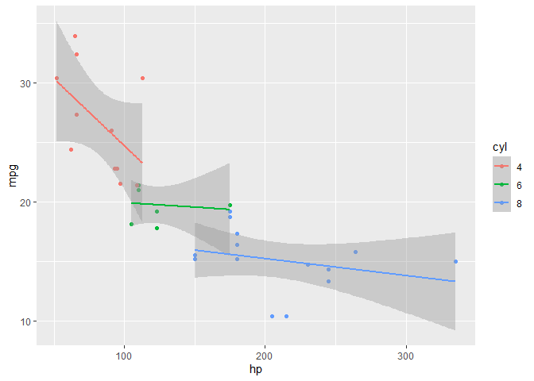

Problem Set 1
================
Alon Rashty
04/04/2021

### About the Course

#### Question 1

Because we need to identify the causal factor in order to apply the
research results on policymaking, otherwise we could “tackle” the wrong
one and not get the results we aimed for. Causal inference is not ML
main goal, and instead it is interested in the best predictions.

#### Question 2

We need to have (or to assume) the error is not correlated with the
covariates (omitted variables), so we don’t have biased estimates. Also,
when we analyze experiments we need to have a good enough randomization
between the treatment and control groups.

#### Question 3

-   The linearity assumption means that we are looking for the average
    treatment effect although it might be heterogeneous.

### RStudio

#### Question 1

``` r
library(tidyverse)
library(kableExtra)
```

#### Question 2

``` r
iris %>%
  select(contains("Sepal") | Species) %>%
  group_by(iris$Species) %>%
  summarise(Average_Sepal_Length = mean(iris$Sepal.Length))
```

    ## # A tibble: 3 x 2
    ##   `iris$Species` Average_Sepal_Length
    ##   <fct>                         <dbl>
    ## 1 setosa                         5.84
    ## 2 versicolor                     5.84
    ## 3 virginica                      5.84

#### Question 3

``` r
mtcars %>%
  mutate(cyl = as.factor(cyl)) %>%
  ggplot(aes(x = hp, y = mpg, color = cyl)) +
    geom_point() +
    geom_smooth(method = lm)
```

<!-- -->
